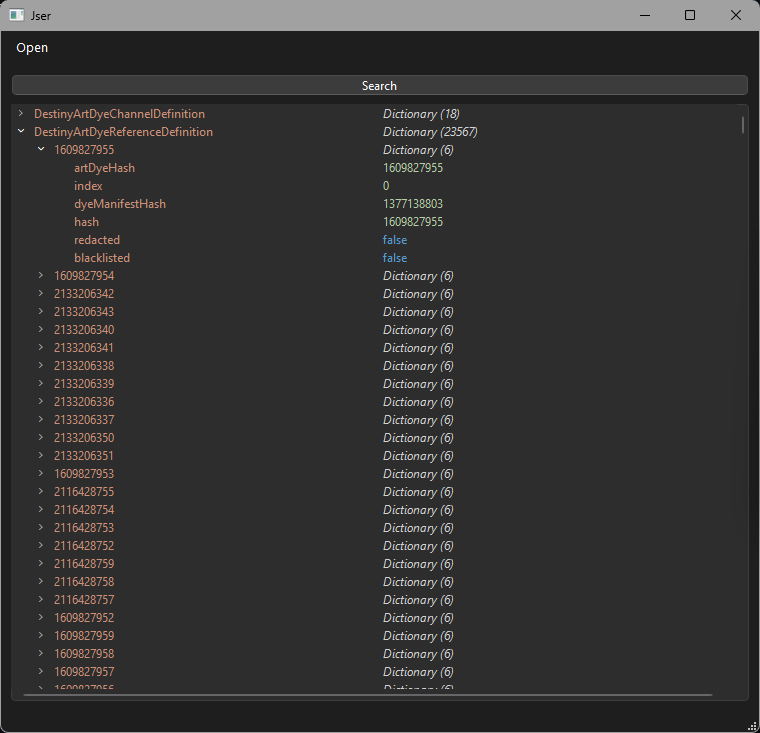
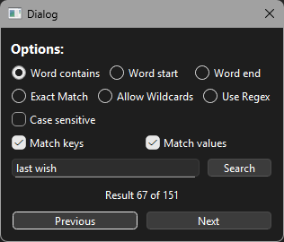
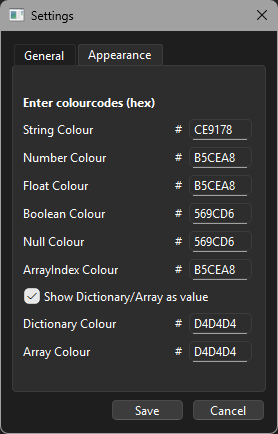

# Jser
## Infos
Jser is a fast & memory efficient json parser written c++ with a minimalistic UI. It features a search menu and settings to adjust your colour prefrences. (Dark/Light mode is controlled by your system settings)

## Download
Just download either the static or dynamic version over at the releases tab. (Note that the static version is a bit slower than the dynamic one)

## Currently supported types:
**TLDR: It supports the entire [Json standard](https://www.json.org/json-en.html) and even more** (Don't ask me how booleans as keys make sense)
- Arrays
  - arrays
  - dictionaries
  - strings
  - numbers
  - floats
  - booleans
  - null
    
- Dictionaries
  - dictionaries **(value only)** 
  - arrays **(value only)**
  - strings
  - numbers
  - floats
  - booleans
  - null **(value only)**

## Dependencies
- [mio](https://github.com/vimpunk/mio) to map and read files
- [Qt](https://qt.io) as the framework

## Screenshots

### Main menu

### Search Dialog

### Settings
